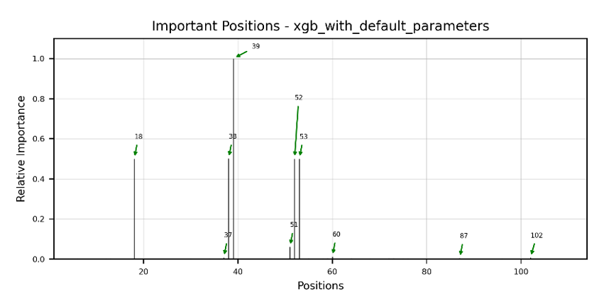

# Using Transformer to Extract Structure Information for Multi-Sequences to Boost Function Learning  -- deepBreaks

**Complete Capstone Project by: Aihan Liu, Hsueh-Yi Lu**  
**Master in Data Science, May 2023**


## Installation for using deepBreaks ##

## Installation ##
* First install *conda*  
Go to the [Anaconda website](https://www.anaconda.com/) and download the latest version for your operating system.  
* For Windows users: do not forget to add `conda` to your system `path`
* Second is to check for conda availability  
open a terminal (or command line for Windows users) and run:
```
conda --version
```
it should out put something like:
```
conda 4.9.2
```
if not, you must make *conda* available to your system for further steps.
if you have problems adding conda to PATH, you can find instructions
[here](https://docs.anaconda.com/anaconda/user-guide/faq/).  

### Windows Linux Mac ###
If you are using an **Apple M1/M2 MAC** please go to the [Apple M1/M2 MAC](#apple-m1m2-mac) for installation
instructions.  
If you have a working conda on your system, you can safely skip to step three.  
If you are using windows, please make sure you have both git and Microsoft Visual C++ 14.0 or greater installed.
install [git](https://gitforwindows.org/)
[Microsoft C++ build tools](https://visualstudio.microsoft.com/visual-cpp-build-tools/)
In case you face issues with this step, [this link](https://github.com/pycaret/pycaret/issues/1254) may help you.
1) Create a new conda environment (let's call it deepBreaks_env) with the following command:
```
conda create --name deepBreaks_env python=3.9
```
2) Activate your conda environment:
```commandline
conda activate deepBreaks_env 
```
3) Install *deepBreaks*:
install with pip:
```commandline
pip install deepBreaks
```
or you can directly install if from GitHub:
```commandline
python -m pip install git+https://github.com/omicsEye/deepbreaks
```
### Apple M1/M2 MAC ###
1) Update/install Xcode Command Line Tools
  ```commandline
  xcode-select --install
  ```
2) Install [Brew](https://brew.sh/index_fr)
  ```commandline
  /bin/bash -c "$(curl -fsSL https://raw.githubusercontent.com/Homebrew/install/HEAD/install.sh)"
  ```
3) Install libraries for brew
  ```commandline
  brew install cmake libomp
  ```
4) Install miniforge
  ```commandline
  brew install miniforge
  ```
5) Close the current terminal and open a new terminal
6) Create a new conda environment (let's call it deepBreaks_env) with the following command:
  ```commandline
  conda create --name deepBreaks_env python=3.9
  ```
7) Activate the conda environment
  ```commandline
  conda activate deepBreaks_env
  ```
8) Install packages from Conda
  ```commandline
  conda install lightgbm
  pip install xgboost
  ```
9) Finally, install *deepBreaks*:
install with pip:
```commandline
pip install deepBreaks
```
or you can directly install if from GitHub:
```commandline
python -m pip install git+https://github.com/omicsEye/deepbreaks
```

## Guide
Follow these steps to use the deepBreaks environment and run the examples:

1. Make sure to set up the deepBreaks environment before running the examples.

2. Switch the data file path to the path you place your data.

2. For example, to run the HIV.py file, execute the code and print out the plots to view the results.

3. For different results, you can modify the sequence length and the number of sequences used for training in the code. Feel free to experiment with different values.

4. Follow the steps of CoT-RNA-Transfer to get the contact matrix.


## Important Position


## Model Performance


Citation:

Mahdi Baghbanzadeh, Tyson Dawson, Bahar Sayoldin, Todd H. Oakley, Keith A. Crandall, Ali Rahnavard (2023). deepBreaks: a machine learning tool for identifying and prioritizing genotype-phenotype associations , https://github.com/omicsEye/deepBreaks/.

@misc{https://doi.org/10.48550/arxiv.2302.06120,
  doi = {10.48550/ARXIV.2302.06120},
  url = {https://arxiv.org/abs/2302.06120},
  author = {Jian, Yiren and Gao, Chongyang and Zeng, Chen and Zhao, Yunjie and Vosoughi, Soroush},
  keywords = {Quantitative Methods (q-bio.QM), Machine Learning (cs.LG), FOS: Biological sciences, FOS: Biological sciences, FOS: Computer and information sciences, FOS: Computer and information sciences},
  title = {Knowledge from Large-Scale Protein Contact Prediction Models Can Be Transferred to the Data-Scarce RNA Contact Prediction Task},
  publisher = {arXiv},
  year = {2023},
  copyright = {arXiv.org perpetual, non-exclusive license}
}


Please feel free to customize the template as needed and add any additional sections or information that may be relevant to your specific project.

